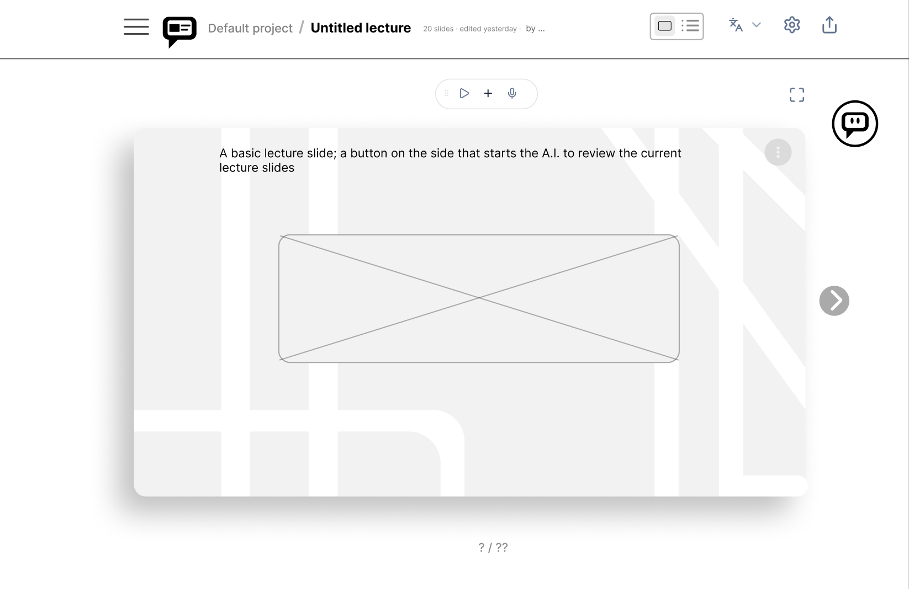
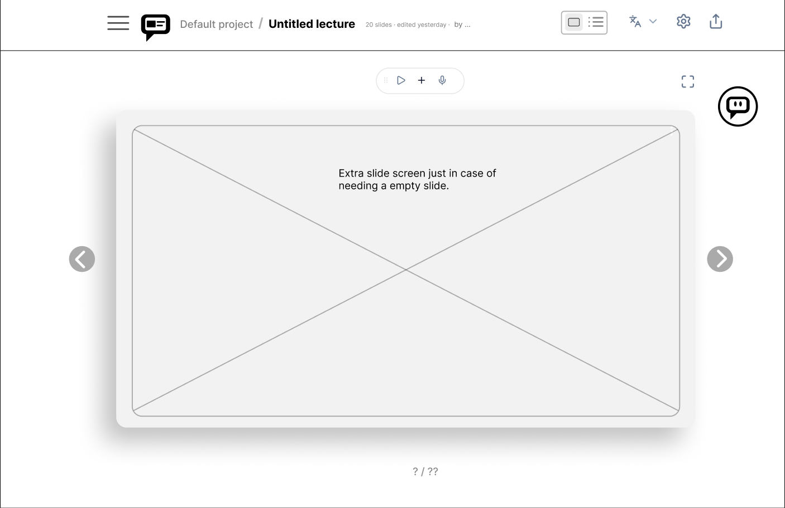
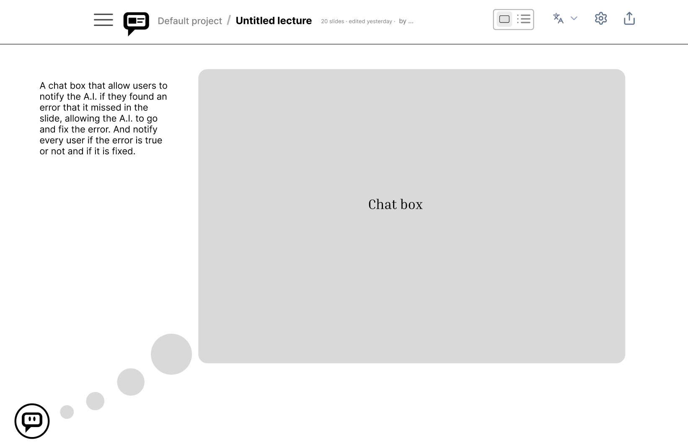
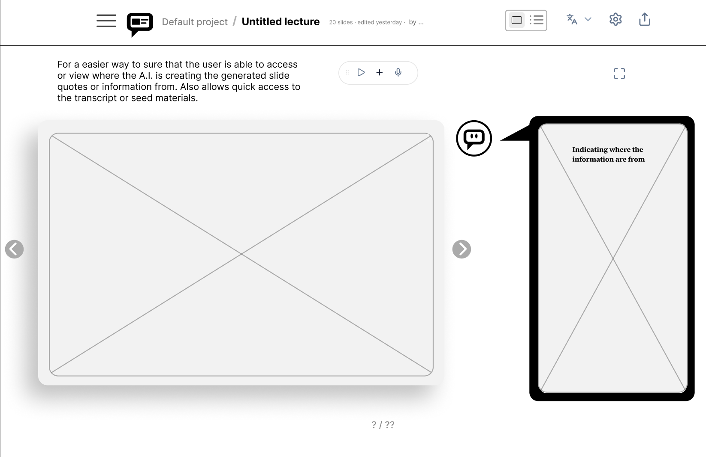
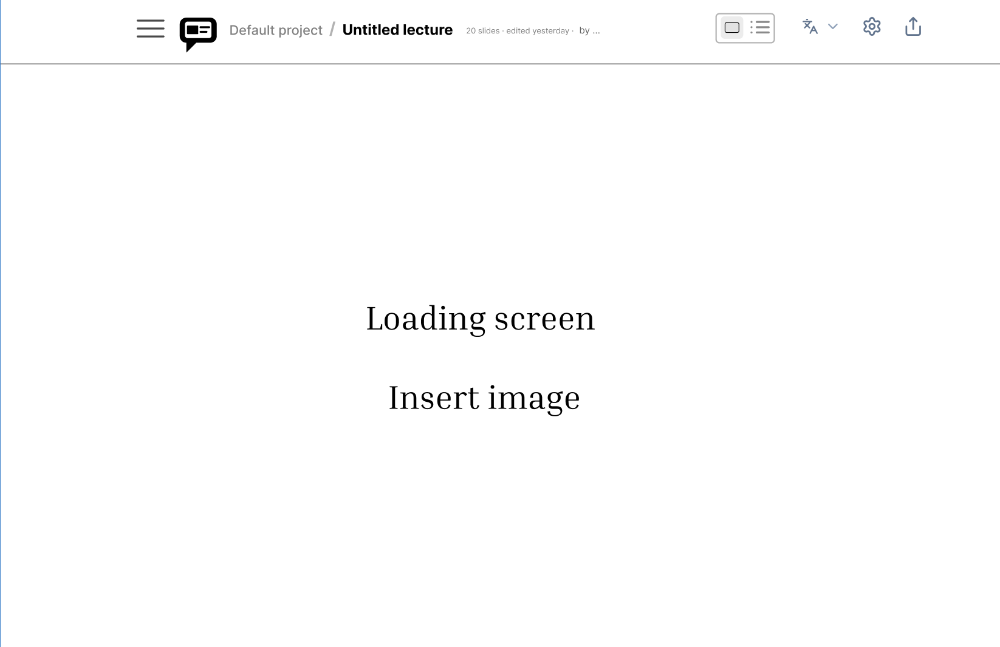
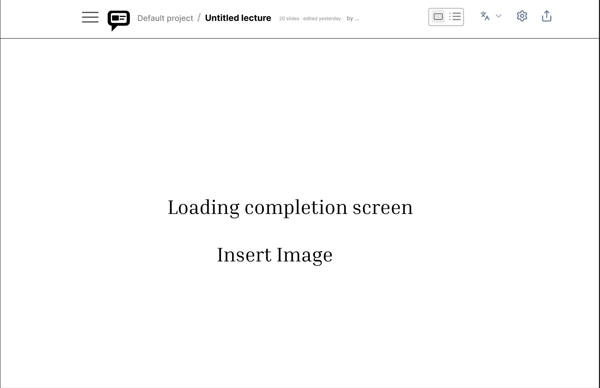
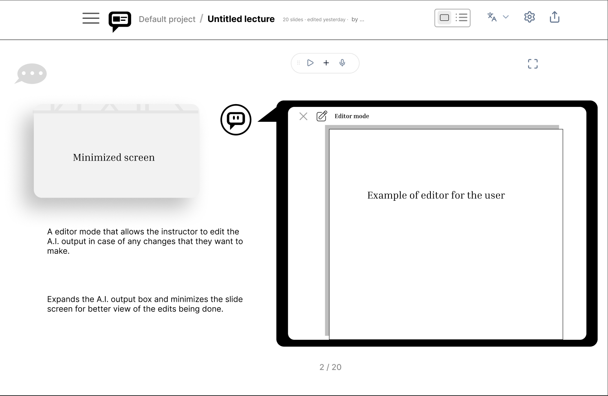
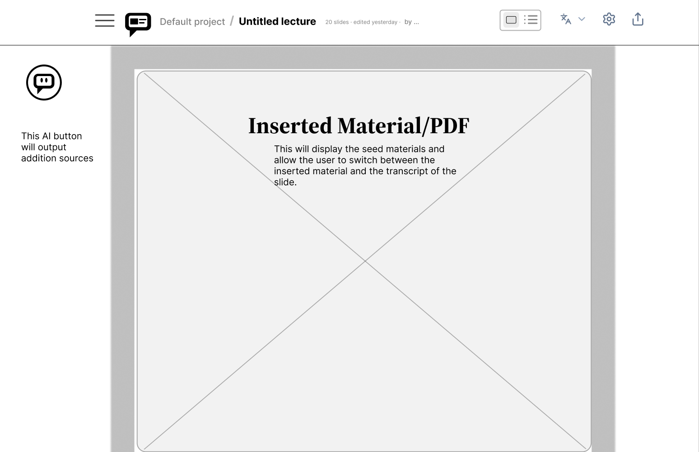

# Specification Phase Exercise

A little exercise to get started with the specification phase of the software development lifecycle. In this exercise, your team specifies a set of improvements and new features for [The Slide Machine](https://theslidemachine.com) — see the [instructions](instructions.md) for detail, and the [background](background.md) for an introduction to the software product you are tasked with extending.

## Team members

[Andy Chi](https://github.com/ac11238)
[Eddy Zhang](https://github.com/Yded21)
[Miki Osada](https://github.com/mosada2515)
[Tyler Wu](https://github.com/uwtz)

## Review of the Current Application

See instructions. Delete this line and replace with your team's findings from using the live app at https://theslidemachine.com — at least 10 specific observations, each labeled as a strength, a weakness, or a gap, and drawn from more than one team member's use of the app.

## Prior Art & Originality

See instructions. Delete this line and replace with a short statement of what your team checked (the project's Future Work and Open Questions, its roadmap, and its open issues and pull requests) and which parts of your proposal are original — new work not already specified, scheduled, or proposed by someone else.

## Stakeholders

See instructions. Delete this line and replace with the name(s) of the stakeholder(s) you interviewed and lists showing their goals/needs, and problems/frustrations. Note which type of user each stakeholder represents. You may use pseudonyms or partial names to maintain their privacy, but you must privately share their full names and contact information as part of your submission of this exercise

## Product Vision Statement

See instructions. Delete this line and place your Product Vision Statement here — one sentence describing the improvements and new features your team is proposing for The Slide Machine.

## User Requirements

Student:
- As a student, I want to be able to initate an AI auto checker, which will provide citations for the content of the slides, so that I can check on the factuality of the slide.
- As a student, I want to click the AI checker button to see sources relating to the content of the slide so that I know the slide is trustworthy.
- As a student, I want to click on the inlined citation to see sources relating to the content of the slide, and vice versa, so that I know the statement is trustworthy.
- As a student, I want to click on individual citations provided by the AI auto checker and open a seperate page with the source so that I can do further readings on the topic.
- As a student, I want the opened source to have related text highlighted so that I don't have to go looking for where the citation is refering to.
- As a student, I want the AI auto checker to provide additional resources from the web relating to the content of the slide so that multiple sources can be checked to reduce biases and inaccuracies.
- As a student, I want to see the result of the AI auto checker from the instructor or other students so that I don't have to run it again.
- As a student, I want to see edits made to the citation by the instructor so that I have the most up to day version of it.
- As a student, I want to be notified when the content of the citation has been modified so that I can see the latest changes.
- As a student, I want to mark certain citations for review so that the instructor can look over potentially inaccurate citations.

Instructor:
- As an instructor, I want to be able to initate an AI auto checker so that I can examine the accuracy of the contents and provide students with additional resources.
- As an instructor, I want to click on the citation links to open the source so I can examine the accuracy of the slides.
- As an instructor, I want to click on the citation to see where in the slide it is refering to so that I can check if it is cited correctly.
- As an instructor, I want to edit the citations so that I can remove false citations and provide students with accurate sources.
- As an instructor, I want to be notified when students have mark a citation for review so that I can immediately go review the accuracy of the citation.
- As an instructor, I want to mark citations as reviewed so that students know the citations is not unchecked AI generated content.
- As an instructor, I want to see the result of the AI auto checker from the students so that I review them for accuracy.
- As an instructor, I want to be the only one who can run citations so that students won't see AI generated info without first being reviewed by me.
- As an instructor, I want to limit what source files can be accessed through citation so that I can keep certain information private.
- As an instructor, I want to the AI to provide additional resources to the student so that they can do further readings.

## Activity Diagrams

See instructions. Delete this line and place images of your UML Activity diagrams here, each with the text of the user story it illustrates.

## Wireframes
<table>
  <tr>
    <td></td>
    <td></td>
  </tr>
  <tr>
    <td></td>
    <td></td>
  </tr>
  <tr>
    <td></td>
    <td></td>
  </tr>
  <tr>
    <td></td>
    <td></td>
  </tr>
</table>

## Clickable Prototype

Public prototype link: https://www.figma.com/proto/m49LvJzO3ys8Qu3oYZOTyc/Untitled?node-id=1-2&t=tivDDNUHfqrbaIVC-1&scaling=min-zoom&content-scaling=fixed&page-id=0%3A1&starting-point-node-id=1%3A2&show-proto-sidebar=1 

## Stakeholder Demo

See instructions. Delete this line and place a link to the deck The Slide Machine generated during your presentation here, after you have presented.

## Exit Ticket

See instructions. Delete this line and place a link to the exit-ticket quiz you generated from your demo deck and distributed to the class, along with a short note on what — if anything — you had to correct in the generated questions before publishing.
